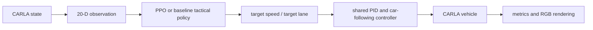

# Reinforcement Learning for Highway Tactical Decision-Making in CARLA

This repository asks whether a state-based PPO agent can make safer and more
efficient highway overtaking and lane-change decisions than random, fixed
keep-lane, and simple rule-based policies under varying CARLA traffic
conditions. The implementation deliberately stays narrow: CARLA 0.9.16,
Town04, one Gymnasium environment, one Stable-Baselines3 PPO policy, and three
non-learning baselines.

The learned component is high-level tactical decision-making. PPO never emits
steering, throttle, or brake values. A shared waypoint/PID controller executes
target-lane and target-speed decisions for every policy, with the same minimal
car-following override to prevent the task from collapsing into emergency
braking. This is not end-to-end autonomous driving and provides no safety
guarantee.

> **Project question:** Can a PPO agent learn safer and more efficient highway
> overtaking and lane-change decisions than random, fixed keep-lane, and simple
> rule-based policies under varying CARLA traffic conditions?

## Design

The PPO policy observes a normalized 20-dimensional state vector: ego speed,
target speed, lane offset, heading error, adjacent-lane availability,
lane-change state, and front/rear gap and relative-speed features for the left,
current, and right lanes.

The five tactical actions are `MAINTAIN`, `ACCELERATE`, `DECELERATE`,
`CHANGE_LEFT`, and `CHANGE_RIGHT`. Lane-change requests are checked for legal
same-direction lanes, front/rear gaps, and rear TTC. Accepted decisions are
tracked by a waypoint controller; rejected decisions execute as maintain and
receive the configured penalty.



The three baselines are:

- uniformly seeded random tactical actions;
- fixed keep-lane, with shared car following behind slower traffic;
- a transparent rule-based overtaking policy that prefers a safe left pass.

Evaluation uses a frozen paired manifest spanning three traffic densities,
three weather presets, and ten held-out seeds: 90 identical conditions per
policy and 360 episodes overall. Analysis reports Wilson intervals for binary
rates, seeded bootstrap intervals for continuous metrics, and condition-paired
PPO-minus-baseline differences. RGB chase-camera video is used only during
rendering.

## Repository

```text
.
├── README.md
├── requirements.txt
├── .gitignore
├── config.yaml
├── carla_env.py
├── policies.py
├── run.py
├── notebooks/
│   ├── 01_train_and_evaluate.ipynb
│   └── 02_render_and_report.ipynb
├── reports/
│   ├── main_report.tex
│   ├── technical_log.tex
│   └── generated/
│       └── .gitkeep
└── artifacts/
    └── .gitkeep
```

Generated models, logs, manifests, evaluation CSVs, plots, recordings, frames,
and videos live below `artifacts/` and are gitignored. Generated LaTeX inputs
live below `reports/generated/`.

## Setup

Use Linux x86_64, Python 3.10–3.12, and packaged CARLA 0.9.16. Install ordinary
dependencies before importing project modules:

```bash
python -m pip install -r requirements.txt
python run.py validate-config --config config.yaml
python run.py offline-self-test --config config.yaml
```

The dependency set supports NumPy 2 (`>=2.0,<3.0`) and deliberately preserves
an already compatible NumPy 2 release in Colab. The notebooks neither downgrade
NumPy nor restart merely because it was already imported. They verify the
installed stack in a fresh Python process and leave Colab's CUDA-enabled
PyTorch installation in place.

The default **managed** mode provisions and launches packaged CARLA locally.
Inspect the non-destructive plan before downloading:

```bash
python run.py runtime status --config config.yaml
python run.py runtime prepare --config config.yaml --dry-run
python run.py runtime prepare --config config.yaml
python run.py server start --config config.yaml
python run.py server status --config config.yaml
python run.py server stop --config config.yaml
```

`runtime prepare` validates the archive before extraction, selects the packaged
CARLA 0.9.16 wheel for the current CPython tag, and never starts the server.
`--force-download`, `--force-extract`, `--no-drive-cache`, and
`--keep-local-archive` provide deliberate recovery controls. Use `--rendering`
on `server start` for RGB evaluation. External mode remains available by
setting `carla.server.mode: external` or `CARLA_SERVER_MODE=external`; the
repository never stops an external server.

## Hosted Colab execution

Manually select the Colab **2026.04** runtime version when available and a
**GPU** hardware accelerator, then mount Drive. The first session downloads
the official CARLA archive to `/content`, validates it, and caches the archive
plus checksum metadata under
`/content/drive/MyDrive/CARLA_Highway_RL/runtime/`. A later VM copies that
validated cache back to local storage and extracts it. The simulator always
runs from `/content/CARLA_0.9.16`, never from Drive, and its Python client uses
localhost.

Training launches CARLA off-screen and sets the world to no-rendering mode.
Video evaluation restarts the managed server with `--rendering`, still
off-screen, but enables scene rendering for its RGB camera. No remote desktop
is needed. Checkpoints, episode rows, evaluation slices, plots, and each
completed video are synchronized frequently.

```text
runtime prepare
→ server start
→ doctor
→ smoke
→ train in 5K chunks
→ evaluate in ~15-condition slices
→ server stop + server start --rendering
→ render videos one at a time
```

The two notebooks are the execution interfaces. Relevant official references
are the [CARLA 0.9.16 release](https://github.com/carla-simulator/carla/releases/tag/0.9.16),
[packaged installation guide](https://carla.readthedocs.io/en/0.9.16/start_quickstart/),
[rendering options](https://carla.readthedocs.io/en/0.9.16/adv_rendering_options/),
and [Google Colab runtime-version FAQ](https://research.google.com/colaboratory/runtime-version-faq.html).

| Symptom | Recovery |
|---|---|
| No GPU assigned | Select **Runtime → Change runtime type → GPU**, reconnect, and rerun status; do not install drivers. |
| Vulkan unavailable or software-only | Run the notebook apt cell, inspect `vulkaninfo --summary`, then reconnect to a new GPU VM if NVIDIA Vulkan is still absent. |
| Insufficient local disk | Free `/content` space; provisioning temporarily needs both the compressed archive and extraction. |
| Incomplete Drive archive | Remove only the incomplete Drive `.part` file or rerun with `--force-download`; metadata is written last. |
| Archive checksum mismatch | Rerun `runtime prepare --force-download`; the invalid copy is never extracted. |
| No matching CARLA wheel | Use CPython 3.10–3.12 x86_64 and inspect the candidate wheel names in runtime status. |
| Server exits early | Read the recent log printed by `server start` and check GPU/Vulkan status. |
| Server startup timeout | Inspect `artifacts/logs/runtime/carla_server_*.log`, GPU/Vulkan status, and available memory before retrying. |
| Stale PID record | `server status`, `start`, or `stop` recognizes another VM's hostname/boot ID and removes only the stale local record. |
| RGB sensor returns no frames | Confirm the server was started with `--rendering` and rerun the render-frame smoke test. |
| Disconnect during training | Reinitialize, restore artifacts, and resume the newest 5K checkpoint. |
| Disconnect during evaluation | Reinitialize, restore artifacts, and use `--resume-existing`; completed policy/condition rows are skipped. |

## Core workflow

```bash
python run.py doctor --config config.yaml
python run.py smoke --config config.yaml

python run.py train --config config.yaml --run-name ppo_seed_0 \
  --seed 0 --total-timesteps 5000

python run.py train --config config.yaml --run-name ppo_seed_0 \
  --seed 0 \
  --resume artifacts/models/ppo_seed_0/checkpoints/CHECKPOINT.zip \
  --additional-timesteps 5000

python run.py make-eval-manifest --config config.yaml
python run.py evaluate --config config.yaml \
  --manifest artifacts/manifests/evaluation_manifest.json \
  --model artifacts/models/ppo_seed_0/final_model.zip \
  --policies ppo random keep_lane rule_based
python run.py analyze --config config.yaml \
  --episodes artifacts/evaluations/episode_results.csv
python run.py report-data --config config.yaml
```

Use `--quick` when creating or running a three-seed debugging manifest.
Evaluation can be sliced with `--start-index` and `--end-index`, then safely
continued with `--resume-existing`. Video selection and rendering are:

```bash
python run.py select-videos --config config.yaml \
  --episodes artifacts/evaluations/episode_results.csv \
  --model artifacts/models/ppo_seed_0/final_model.zip
python run.py render-videos --config config.yaml \
  --manifest artifacts/manifests/evaluation_manifest.json \
  --model artifacts/models/ppo_seed_0/final_model.zip --resume-existing
```

Google Drive synchronization copies without deleting destination files:

```bash
python run.py sync --config config.yaml --to-drive \
  --local-root artifacts \
  --drive-root /content/drive/MyDrive/CARLA_Highway_RL
```

## Notebooks

Run [01_train_and_evaluate.ipynb](notebooks/01_train_and_evaluate.ipynb) first.
It restores Drive state, provisions local CARLA, diagnoses the server, performs
smoke tests, trains one restart-safe 5K chunk by default, freezes the paired
manifest, evaluates in restartable slices, and analyzes. Then run
[02_render_and_report.ipynb](notebooks/02_render_and_report.ipynb) with
rendering enabled to select scenarios, create six honest qualitative videos,
generate report inputs, and optionally compile the reports. Each major section
is restartable after rerunning its notebook's common initialization.

## Results

**Experiments pending.** The repository contains no fabricated training or
evaluation values. After experiments, `report-data` conditionally populates the
reports from the generated CSVs.

## Reproducibility and limitations

Python, NumPy, Traffic Manager, environment, and SB3 seeds are fixed; CARLA uses
synchronous 0.05-second steps; every run saves a resolved configuration and
hash; and all policies replay the same manifest rows. Exact GPU/rendering
behavior can still vary across CARLA installations. The environment uses
privileged simulator state, approximate lane-relative vehicle classification,
a compact conventional controller, one primary training seed, and a limited
held-out scenario grid. The car-following override is intentionally minimal,
not a complete safety system.

An optional future comparison may add CARLA's BehaviorAgent as a clearly
separate reference, but it is not part of the implemented four-policy
experiment.
